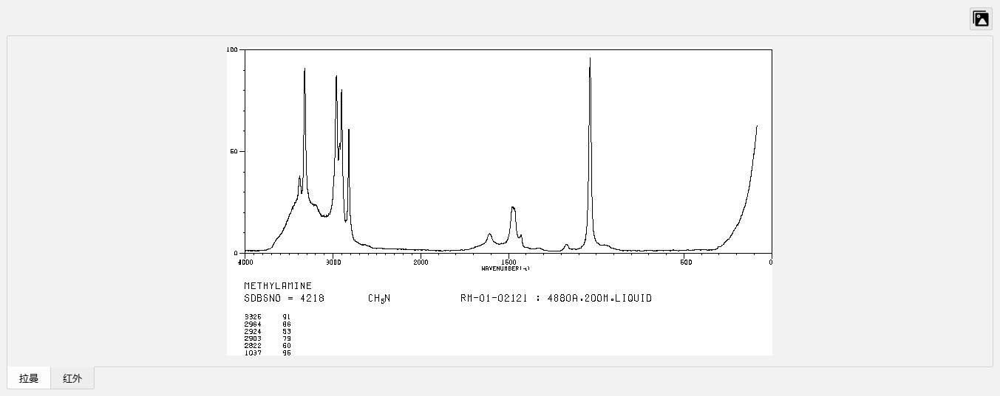

# KnowIt

文档对应版本 1.0.07

## MineIt

1. 菜单栏区
2. 应用列表区
3. 图像操作区
4. 数据表区
5. 属性区

### 菜单栏区

#### 主题

当前提供亮色主题：Lite, OSX_Lite

当前提供暗色主题：Dark, OSX_Dark（图像操作当前仍是亮色）

#### 语言

当前提供：英文，简体中文，繁体中文

**英文是最稳定版本**

### 应用列表区

当前版本为 MineIt

### 图像操作区

: 辅助峰位，用于显示根据图像拟合后得到的峰值

: 自动缩放，y 轴范围根据数据进行收缩

: 裁剪，用户自定义选择区域，鼠标左键按下，拖动获取矩形框，释放进行对应显示

: x 轴翻转，x 轴翻转，0->4000 变为 4000->0

: 原始图像，显示上传的原始图像

### 数据表区

### 属性区

属性分为：所有属性，基本信息，光谱数据，光谱采集条件，样品信息，注释与标签，来源

当窗口过小，鼠标滚轮进行属性滚动显示

**所有属性**：对应所有的字段

**基本信息对应**：

- 化合物名称（英文），可以多个，使用”;“分隔
- 化合物名称（中文），可以多个，使用”;“分隔
- 分子式，当前不支持数字下沉
- 分子量
- 化合物类型
- 类别
- 应用领域
- CAS 编号
- 结构图，原始结构图路径，显示为在服务器上路径
- 状态，限定为 Liquid/Powder/Grain/Gas（液体/粉末/颗粒/气体）

类别与应用领域对应，一（类别）对多（应用领域）关系

**光谱数据对应**：

- 峰位（主要），[https://sdbs.db.aist.go.jp/](https://sdbs.db.aist.go.jp/) 网站拉曼数据库中直接标注
- 峰位（辅助），程序拟合曲线后进行峰位查找获取，仅辅助作用
- 光谱图，原始图像路径，显示为在服务器上路径

**光谱采集条件对应**：

- 仪器型号
- 激光波长
- 激光功率
- 积分次数
- 测量环境：例如：空气/真空/惰性气体
- 测量温度：单位摄氏度

_使用第三方数据，不要求强制输入_

**样品信息对应**：

- 产出于：例如：自然产生/工厂制备
- 存储：例如：避光
- 衍生状态：例如：水合物

**注释与标签对应**：

- 数据版本：自动生成的版本号
- 上次修改：自动生成的时间戳，格式：yyyy-MM-dd hh:mm:ss

**来源对应**：

- 资源：对应的网址等信息

_未作强制要求_

#### 属性操作-添加

创建 ID，ID 为光谱类型和具体编号的组合，必须唯一

#### 属性操作-编辑

#### 特殊编辑操作

: 调出新的编辑窗口

: 进行图片查找并上传
